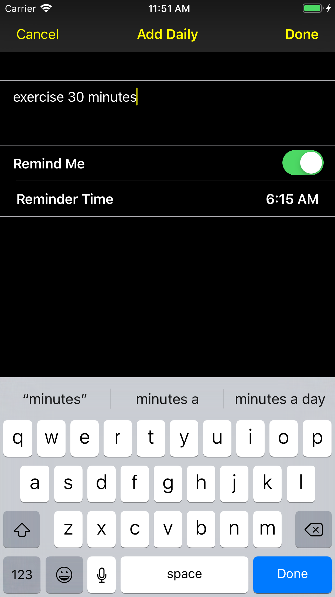
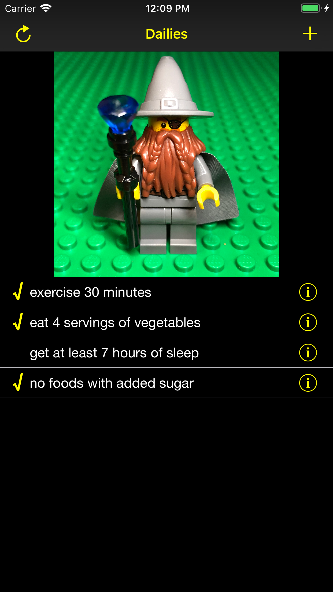
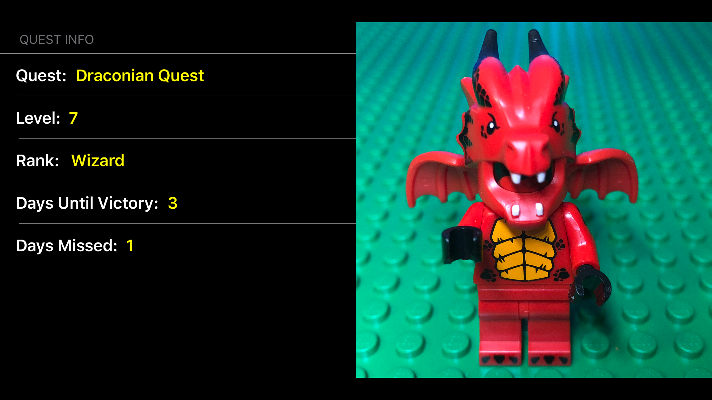

  
      

# Habit Quest

Habit Quest is a habit tracking role-playing game. Build habits by going on quests and defeating the necromancer and his minions.
* Add daily habits you want to work on.
* Schedule daily reminders via User Notifications to your phone's home screen.
* Gain levels and defeat enemies for consecutive perfect days.
* Lose levels when miss consecutive days.
* Change your habits at any time.

## Built With

* XCode 9.4.1
* Swift 4.1

## Author

* John Smith

## License

This project is licensed under the MIT License - see the [LICENSE](LICENSE) file for details.
